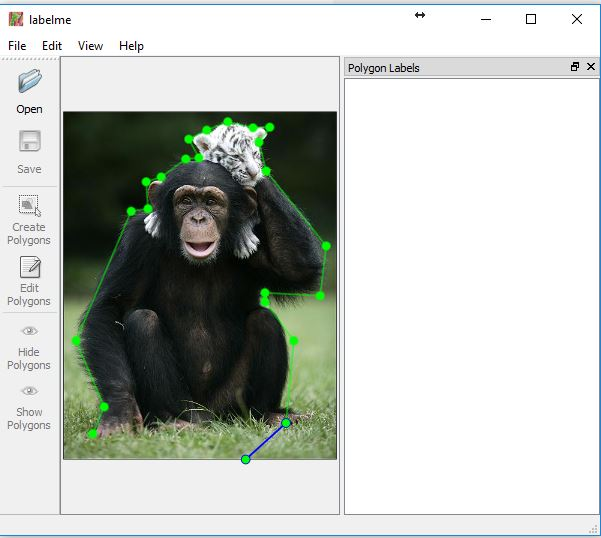
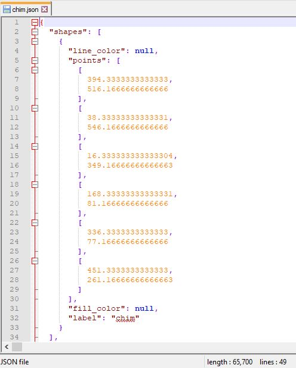

# Keypoint Annotation
To annotate an image we need two software
* [*labelme*](https://pypi.python.org/pypi/labelme) - Tool to annotate object boundary
* [*people_tagger*](https://www2.eecs.berkeley.edu/Research/Projects/CS/vision/shape/hat/) - Tool to annotate object keypoints

## *labelme* - Tool to annotate object boundary
1. **Install** - Install in **Anaconda** platform and **Windows** OS

      You need install [Anaconda](https://www.anaconda.com/download/) then run below in *cmd*(command line):

      * `conda create --name=labelme python=2.7` - creat an environment name *labelme*

      * `activate labelme` - activate the *labelme* enviroment

      * `conda install pyqt` - install *pyqt* package for Graphic User Interface of *labelme* software

      * `pip install labelme` - install *labelme* software by using *pip*

2. **Run** - in *cmd* run:

      * `activate labelme` - activate the *labelme* environment where we installed the *labelme* software by the above commands

      * `labelme` - run the *labelme* software
   
      
      
      * Save the all annotated boundary files in the *segmentation* folder (! these files have same name as image files)
      
      * The boundary annotation will be save in a json file as below:
      
      

## *people_tagger* - Tool to annotate object keypoints

## Annotation procedure
