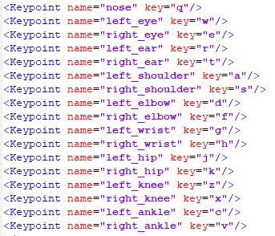

# Keypoint Annotation
To annotate an image we need two software
* [*labelme*](https://pypi.python.org/pypi/labelme) - Tool to annotate object boundary
* [*people_tagger*](https://www2.eecs.berkeley.edu/Research/Projects/CS/vision/shape/hat/) - Tool to annotate object keypoints

## Put all the images in *data/images* folder
Images have to be named in this format: *name_id.img*

Eg: chim_1.jpg chim_2.jpg

## *labelme* - Tool to annotate object boundary
1. **Install** - Install in **Anaconda** platform and **Windows** OS

      You need install [Anaconda](https://www.anaconda.com/download/) then run below in *cmd*(command line):

      * `conda create --name=labelme python=2.7` - creat an environment name *labelme*

      * `activate labelme` - activate the *labelme* enviroment

      * `conda install pyqt` - install *pyqt* package for Graphic User Interface of *labelme* software

      * `pip install labelme` - install *labelme* software by using *pip*

2. **Run** - in *cmd* run:

      * `activate labelme` - activate the *labelme* environment where we installed the *labelme* software by the above commands

      * `labelme` - run the *labelme* software
   
      
      
      * Save the all annotated boundary files in the *segmentation* folder 
      
            ! these files have to have same name as image files
      
            Eg: chim_1.json, chim_2.json
      
      * The boundary annotation will be save in a json file as below:
      
      
      

## *people_tagger* - Tool to annotate object keypoints
1. **Install Java** from this link https://www.java.com/en/download/win10.jsp
2. **Launch the** *people_tagger.jnlp* **file**
3. **Browse to the** *config_chimpanzee.xml* **file**
4. **Annotate image using keyboard**
      - *left_arrow* : previous image
      - *right_arrow* : next image
      - *q* : nose
      - *w* : left_eye
      - ...
      
      See more in *config_chimpanzee.xml* file

      

## Convert annotated file to COCO_DATASET format
* run `python convertXML2JSON.py --data_path data` an *annotation.json* file will be created
